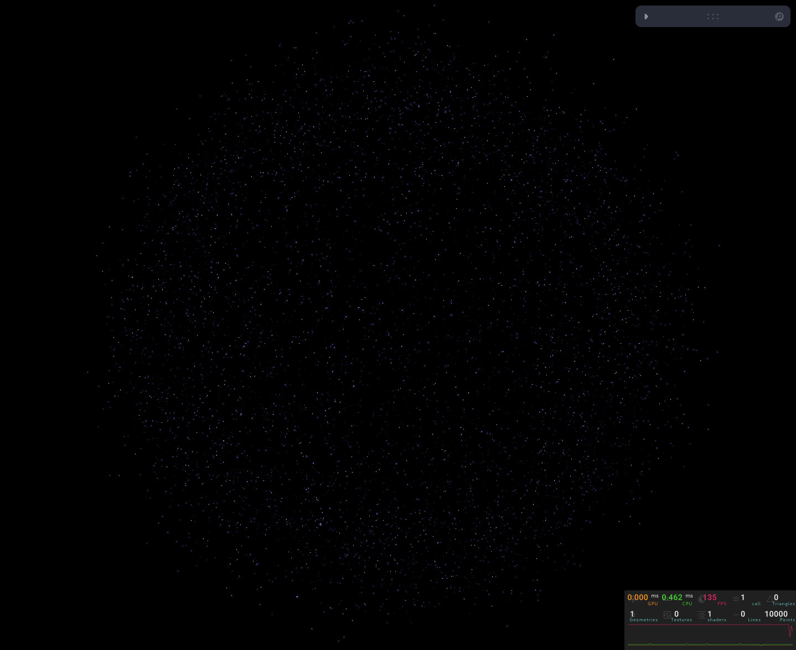
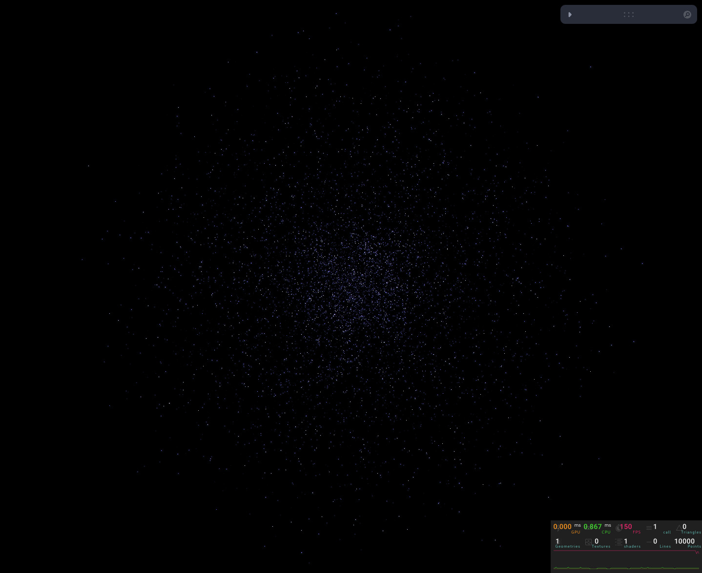
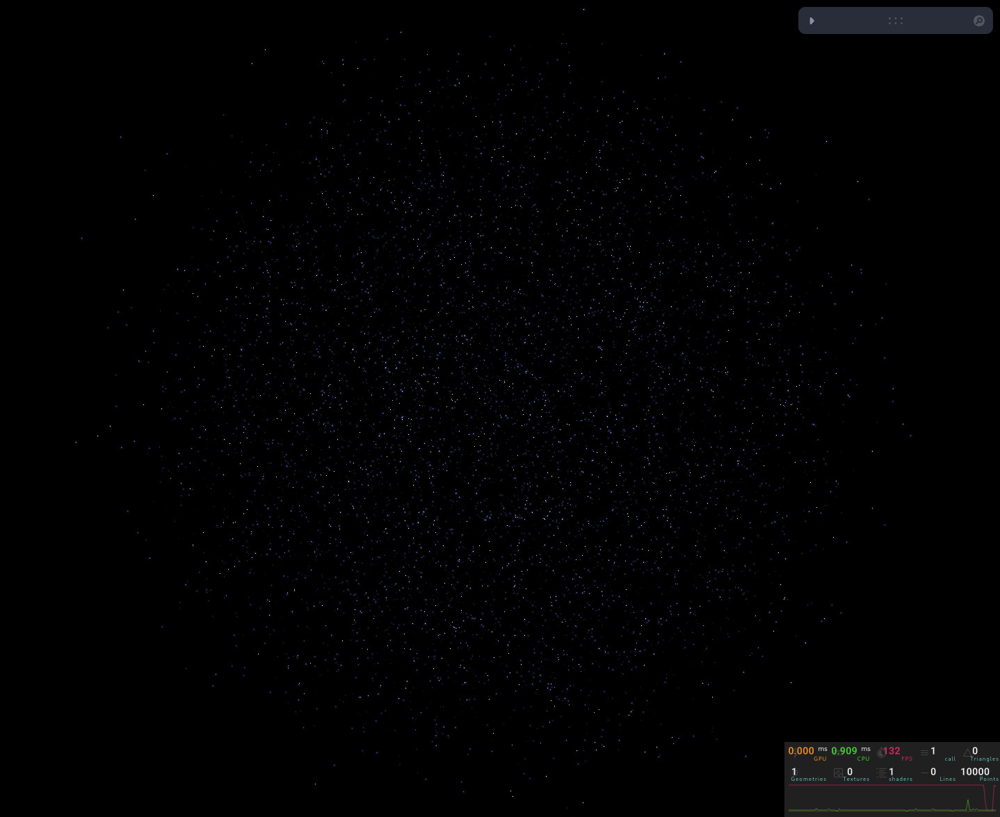
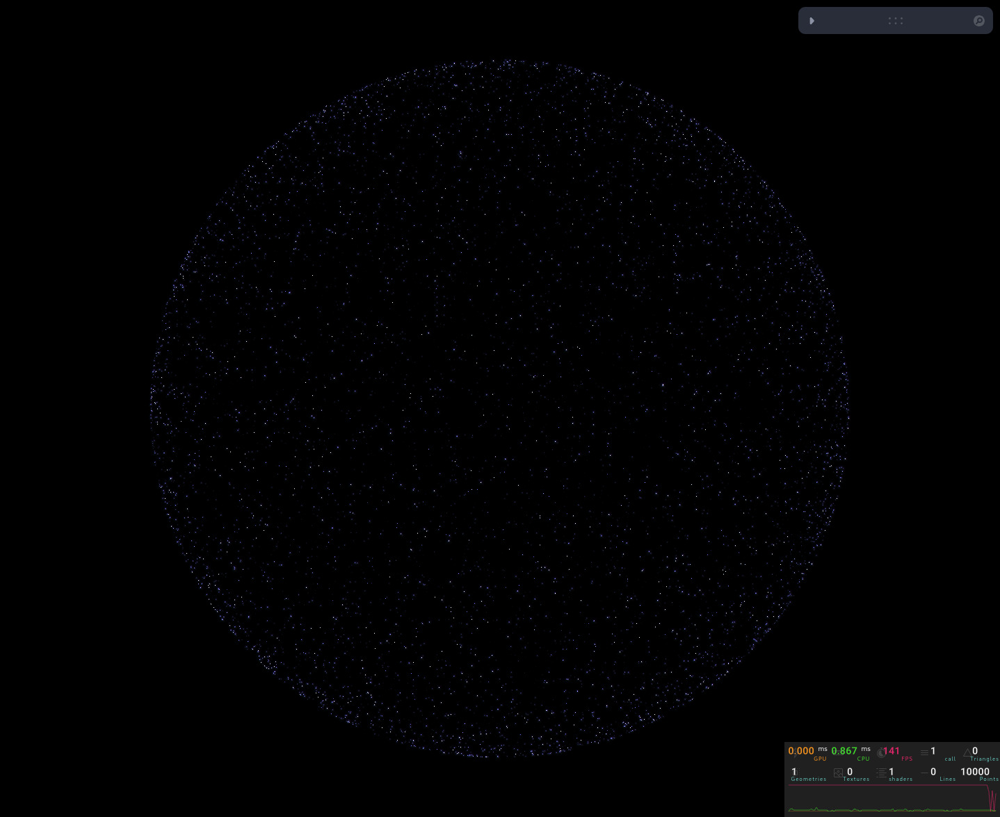
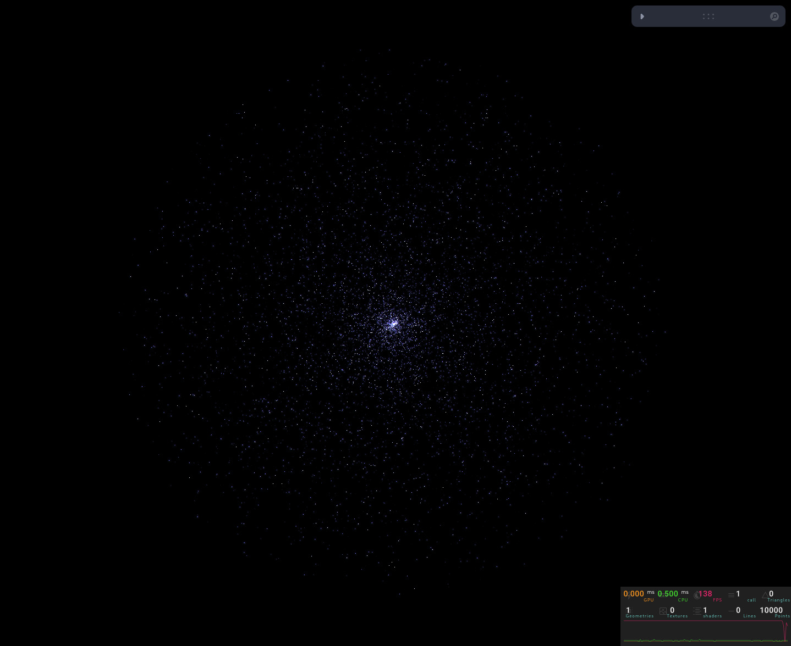
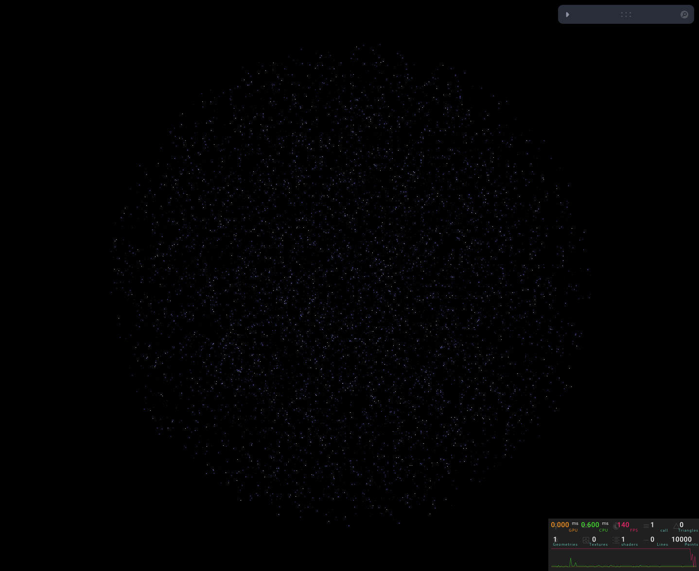

# R3F Particle System Base

This project aims to provide a **base setup** for working with shaders and particles in [React Three Fiber (R3F)](https://github.com/pmndrs/react-three-fiber). The goal is to have a **starting point** for shader-based particle systems, allowing easy modifications without starting from scratch every time.


## Table of Contents
- [Features](#features)
- [Quick Start](#quick-start)
- [Usage](#usage)
  - [Controls](#controls)
  - [Code Structure](#code-structure)
- [Particle Distributions (Examples)](#particle-distributions-examples)
- [How to Modify](#how-to-modify)
  - [Change Particle Distribution](#change-particle-distribution)
  - [Modify Shader Effects](#modify-shader-effects)
- [Troubleshooting](#troubleshooting)
- [Contributing](#contributing)


##  Features

- **Custom Shader Material** using `shaderMaterial` from [@react-three/drei](https://github.com/pmndrs/drei)
- **Particle Distribution Modes:**
  - **Surface**: Particles are distributed on the **surface** of a sphere.
  - **Random**: Particles are **randomly distributed** inside a sphere.
  - **Uniform**: Particles are **uniformly distributed** inside a sphere.
- **Animation Support:** Particles can animate using time-based shader effects.
- **Leva Controls:** Easily tweak parameters like particle size, orbit rotation, and performance settings.
- **Performance Monitor:** Integrated with [r3f-perf](https://github.com/utsuboco/r3f-perf) to track FPS and WebGL stats.

## Quick Start

1. Clone the repository:
   ```bash
   git clone https://github.com/0Shree005/r3fParticleSystem.git && cd r3fParticleSystem
   ```

2. Install dependencies and run the project:
   ```bash
   npm install && npm run dev
   ```

3. Open your browser and navigate to `http://localhost:8080`.
   
4. To access the development server from another device on your network, visit `http://<Host's-Local-IP>:8080`.

##  Usage

###  Controls

This project uses [Leva](https://github.com/pmndrs/leva) to provide UI controls:

- **`pSize`**: Controls the size of each particle.
- **`autoRotate`**: Enables or disables auto-rotation.
- **`autoRotateSpeed`**: Adjusts rotation speed when `autoRotate` is enabled.
- **`perfVisible`**: Toggles the performance monitor visibility.

###  Code Structure

- `Particles.jsx` → Main component that handles particle generation, controls, and shaders.
- `shaders/vertex.glsl` → Custom vertex shader for particle animation.
- `shaders/fragment.glsl` → Custom fragment shader for particle rendering.

## Particle Distributions (Examples)

**Animated - Surface**


**Animated - Random**


**Animated - Uniform**


**Static - Surface**


**Static - Random**


**Static - Uniform**


##  How to Modify

### Change Particle Distribution

Inside `Particles.jsx`, modify the `radius` calculation:

```javascript
// Surface Distribution
const radius = sphereRadius;

// Random Distribution
// const radius = sphereRadius * Math.random();

// Uniform Distribution
// const radius = sphereRadius * Math.cbrt(Math.random());
```

### Modify Shader Effects

#### **Vertex Shader (`vertex.glsl`)**

You can modify how the particles move:

```glsl
modelPosition.x += sin(uTime + aRandom * 70.0) * aScale;
modelPosition.y += sin(uTime + aRandom * 90.0) * aScale;
modelPosition.z += cos(uTime + aRandom * 30.0) * aScale;
```

#### **Fragment Shader (`fragment.glsl`)**

Modify the shape and color of particles:

```glsl
vec3 mixedColor = mix(vec3(0.0), vec3(gl_PointCoord, 1.0), strength);
```

##  Troubleshooting

- **Shader Compilation Errors**: Ensure your GLSL code is valid and free of syntax errors.
- **Performance Issues**: Reduce the number of particles or optimize shader code.
- **Leva Controls Not Working**: Ensure `useControls` is properly imported and used.

##  Contributing

Contributions are welcome! If you have ideas, improvements, or bug fixes, feel free to open an issue or submit a pull request.

1. Fork the repository.
2. Create a new branch (`git checkout -b feature/YourFeatureName`).
3. Commit your changes (`git commit -m 'Add some feature'`).
4. Push to the branch (`git push origin feature/YourFeatureName`).
5. Open a pull request.

